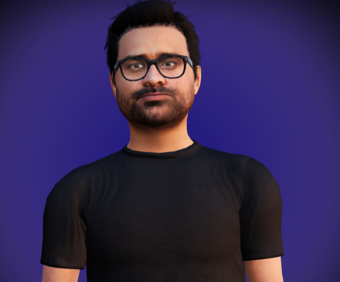

<div align="center">



# AliGen — 3D AI Portfolio Assistant

**Interactive 3D avatar** that speaks, lip-syncs, and answers visitors about Ali Gilani’s work — powered by **React Three Fiber**, **Groq**, and **Amazon Polly**.

[**View demo**](https://aligilani.com) · [**GitHub**](https://github.com/SyedAliRazaGilani)

*Replace the demo URL above if your deployed AliGen instance lives elsewhere.*

</div>

---

## 🎯 Overview

AliGen is a portfolio experience that combines a **glTF avatar** (Avaturn-style mesh with viseme morph targets), **pre-authored voice clips** for nav actions, and **LLM-generated replies** for free-text chat. Visitors can explore **About**, **Work**, **Hobbies**, **Projects**, and **Blogs** through UI panels fed by markdown context, while the assistant stays grounded in a **slim `portfolio-llm.md`** file to limit token use.

---

## ✨ Features

- **🧑‍💻 3D avatar** — `@react-three/fiber`, `@react-three/drei`, custom animations and facial / viseme morphing for lip-sync
- **🎙️ Voice & lip-sync** — Static **WAV + JSON (Rhubarb-style cues)** for template buttons; **Polly + optional Rhubarb** for typed chat replies
- **💬 Chat** — **Groq** (`llama-3.1-8b-instant`) with JSON-structured responses (text, expression, animation)
- **📇 Portfolio UI** — Projects, blogs, and work experience from **`AliGen-backend/context/portfolio.md`**; LLM uses **`portfolio-llm.md`** only
- **🎨 Modern UI** — Tailwind, glass-style panels, dark mode, responsive layout
- **🔗 Integrations** — Chess.com profile card, Steam profile, Spotify podcast card, links to GitHub projects

---

## 🏗️ Architecture

| Layer | Role |
|--------|------|
| **`AliGen-frontend`** | Vite + React SPA, Three.js scene, calls BFF via `VITE_API_URL` |
| **`AliGen-backend`** | Express BFF: `/chat`, `/projects`, `/blogs`, `/work`, static audio, Polly + FFmpeg/Rhubarb pipeline |

Template button clicks return **canned audio + lipsync** (no Groq/Polly for those turns). Typed messages hit **Groq** then **Polly** for TTS.

---

## 🛠️ Tech Stack

**Frontend:** React 18, Vite, Three.js, R3F, Drei, Tailwind, Leva (dev), GSAP / Motion  
**Backend:** Node.js, Express, Groq SDK, AWS Polly, `fluent-ffmpeg` (optional lip-sync pipeline)  
**Assets:** GLB models, animation clips, curated `audios/*.wav` + `*.json` lipsync data  
**Content:** Markdown context under `AliGen-backend/context/`

---

## 📁 Repository Layout

| Folder | App |
|--------|-----|
| **`AliGen-frontend`** | Vite + React + Three.js (browser UI) |
| **`AliGen-backend`** | Express BFF (`index.js`), `context/*.md`, `audios/` |

---

## 🚀 Run Locally

### Frontend (Vite)

```bash
cd AliGen-frontend
yarn install
yarn dev
```

### Backend (Express)

```bash
cd AliGen-backend
yarn install
yarn dev
```

Set **`VITE_API_URL`** in `AliGen-frontend/.env` to your BFF origin (e.g. `http://localhost:3000`).

---

## 🔐 Environment Variables

**Express BFF** — `AliGen-backend/.env`:

| Variable | Purpose |
|----------|---------|
| `PORT` | HTTP port for the API |
| `GROQ_API_KEY` | Groq chat completions |
| `AWS_ACCESS_KEY_ID`, `AWS_SECRET_ACCESS_KEY`, `AWS_REGION` | Amazon Polly (and AWS usage if applicable) |
| `FRONTEND_URL` | Optional CORS / deployment hint |

**Vite client** — `AliGen-frontend/.env`:

| Variable | Purpose |
|----------|---------|
| `VITE_API_URL` | Base URL of the Express BFF |
| `VITE_CSGO_PROFILE_URL` | Optional override for Steam profile link (gaming card) |

---

## 🎵 Audio & Lip-Sync

- **Nav templates** (About, Work, Hobbies, Projects, Blogs, errors): read from **`AliGen-backend/audios/`** as base64 WAV + JSON mouth cues.
- **Typed chat**: Polly synthesizes MP3; optional Rhubarb step produces per-message JSON (see `index.js`).

---

## 🤖 LLM & Token Discipline

- Chat prompts inject **`context/portfolio-llm.md`** only — **not** the full site markdown.
- **`portfolio.md`** powers `/projects`, `/blogs`, `/work` and the rich UI panels.
- Chat history is capped server-side to keep prompts small.

---

## ☁️ Deploy Notes

- **Static frontend (e.g. Render):** set service **root** to `AliGen-frontend`, build `yarn install && yarn build`, publish `dist`. See `AliGen-frontend/render.yaml`.
- **BFF:** run `node index.js` (or `yarn start`) on a Node host; point `VITE_API_URL` at that origin.

---

## 📜 Optional: Folder Name Swap

If you ever clone an old fork with reversed folder names:

```bash
mv AliGen-backend AliGen-frontend-tmp
mv AliGen-frontend AliGen-backend
mv AliGen-frontend-tmp AliGen-frontend
```

If **`AliGen-frontend`** already contains Vite and **`AliGen-backend`** contains `index.js`, skip this.

---

## 🙏 Credits

- **3D / React Three** — [pmndrs](https://github.com/pmndrs) ecosystem  
- **Lip-sync cues** — [Rhubarb Lip Sync](https://github.com/DanielSWolf/rhubarb-lip-sync) (or compatible JSON format)  
- **AliGen** — portfolio assistant for **Ali Gilani**

---

<p align="center">
  <b>AliGen</b> — 3D AI portfolio chatbot · <a href="https://aligilani.com">aligilani.com</a>
</p>
